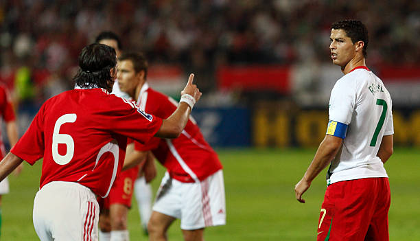

## Curriculum Vitae 
 
**Nombre:** Jefferson Ronaldo 
**Edad:** 18 Años 
**carreras:** Geografía y Futbol 
**Cursos Aprobados:** 14 cursos 
**Habilidades:** Especialista en SIG 
Habilidades en cartografía 
Profesional en trabajo de campo 
Programación Avanzada 
Goleador nato
**Logros importantes:** 
1. [Campeón de champions](https://pbs.twimg.com/media/Dl3OKoJXsAEQ9bF?format=jpg&name=900x900) 
2. [Campeón de premier league](https://pbs.twimg.com/media/Fh3BQAsaAAEdlzA.jpg) 
3. [Balón de oro x5](https://phantom-marca.unidadeditorial.es/26f0a441e42e15990e97f265e073833c/resize/1320/f/jpg/assets/multimedia/imagenes/2019/06/10/15601758168566.png)

